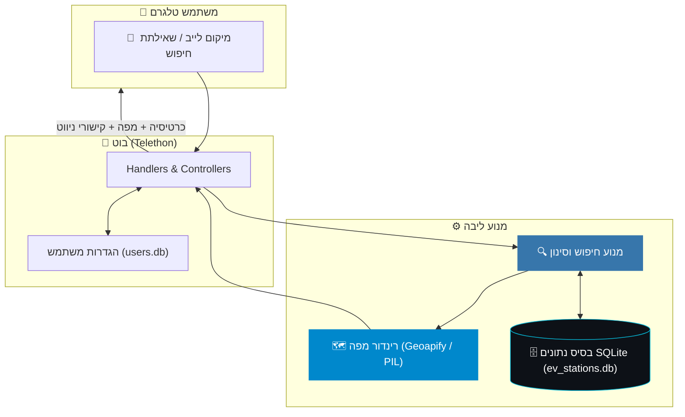
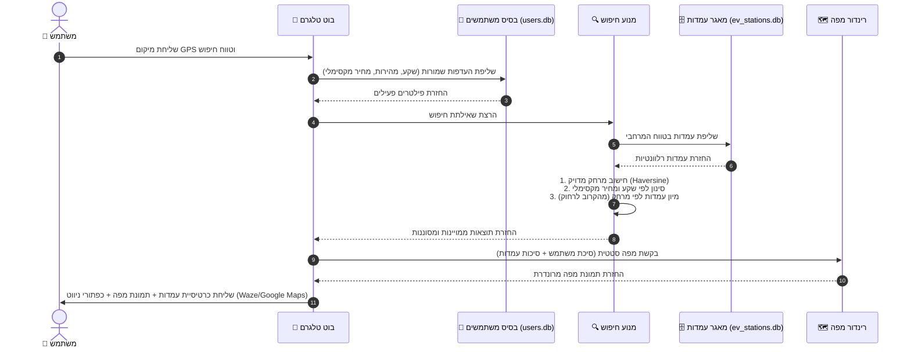
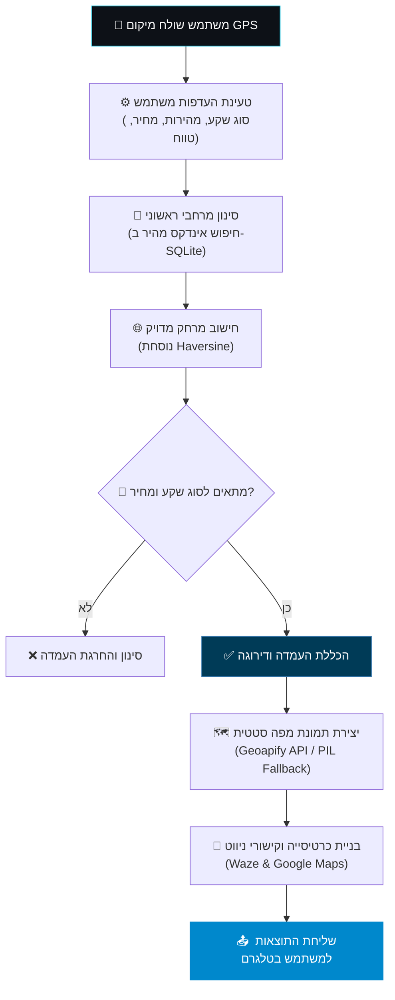

<div align="center">

# ⚡ EV Charging IL Bot
### חיפוש עמדות טעינה לרכב חשמלי וניווט חכם בישראל

**מאגר מאוחד של כ-3,400 אתרי טעינה לרכב חשמלי מכל המפעילים בארץ.**<br>
תמונות מפה ויזואליות, סינון חכם לפי סוג שקע ומהירות, סטטוס זמינות בזמן אמת וניווט בלחיצה אחת ל-Waze ו-Google Maps.

<br>

🌐 **[English](README.md)** | **עברית**

<br><br>

<a href="#-הרצה-מהירה"></a>
<a href="#-תכונות-עיקריות"></a>
<a href="#-ארכיטקטורה"></a>
<a href="#-תהליך-החיפוש-והסינון"></a>

<br><br>


</div>

---

## 📑 תוכן עניינים

<table>
<tr>
<td valign="top">

**צעדים ראשונים**
* [✨ תכונות עיקריות](#-תכונות-עיקריות)
* [🧠 ארכיטקטורה](#-ארכיטקטורה)
* [🔍 תהליך החיפוש והסינון](#-תהליך-החיפוש-והסינון)
* [🗄️ מקורות הנתונים](#️-מקורות-הנתונים)

</td>
<td valign="top">

**שימוש והתקנה**
* [🚀 הרצה מהירה](#-הרצה-מהירה)
* [⚙️ קונפיגורציה](#️-קונפיגורציה)
* [🗺️ מנגנון המפות](#️-מנגנון-המפות)

</td>
<td valign="top">

**מידע על הפרויקט**
* [🛡️ פרטיות](#️-פרטיות)
* [📄 רישיון](#-רישיון)

</td>
</tr>
</table>

---

## ✨ תכונות עיקריות

<table>
<tr>
<td width="33%" valign="top">

### 🔌 מידע מלא על עמדה
מרחק מדויק, כתובת, מפעיל, סוגי מחברים (CCS2, Type 2, CHAdeMO), הספק בקילואט (kW), תעריף לקוט"ש וסטטוס זמינות.

</td>
<td width="33%" valign="top">

### 🗺️ מפה ויזואלית
תמונת מפה דינמית סביב מיקום ה-GPS שלך. המיקום מסומן בסיכה אדומה והעמדות בסמני ברק ירוקים.

</td>
<td width="33%" valign="top">

### 🚗 ניווט בלחיצה
כפתורי פתיחה ישירים ל-Waze ו-Google Maps לניווט מהיר אל העמדה הנבחרת.

</td>
</tr>
<tr>
<td valign="top">

### ⚙️ הגדרות מותאמות
שמירת העדפות משתמש עבור סוג שקע, מהירות טעינה, טווח חיפוש (10, 20, 40, 100 ק"מ) וסינון תעריף מקסימלי.

</td>
<td valign="top">

### 🏛️ אימות רשמי
תג ויזואלי "מאומת משרד האנרגיה" על עמדות המופיעות במאגר הממשלתי הרשמי.

</td>
<td valign="top">

### 🗄️ איחוד 5 מקורות
פייפליין נתונים הממזג 5 מאגרים נפרדים לבסיס נתונים SQLite נקי וללא כפילויות.

</td>
</tr>
</table>

---

## 🧠 ארכיטקטורה

המערכת מורכבת מבוט טלגרם, מנגנון חיפוש עמדות ורינדור מפות, ופייפליין עיבוד נתונים.

| רכיב | טכנולוגיה | תפקיד |
|:---|:---|:---|
| 🤖 **Telegram Bot** | `Telethon` (Python 3.11) | אינטראקציית משתמש, קבלת מיקום ומקלדות inline |
| 🔍 **מנגנון חיפוש** | נוסחת `Haversine` | חישוב מרחקים וסינון לפי קריטריונים |
| 🗺️ **רינדור מפות** | API של `Geoapify` / `PIL` | יצירת מפות סטטיות עם סיכות ואוברליי |
| 💾 **אחסון נתונים** | `SQLite` | שמירת העדפות משתמש (`users.db`) |
| 🛠️ **בניית מאגר** | סקריפט `Python` | סריקה, איחוד וניקוי 5 מקורות נתונים (`ev_stations.db`) |



---

## 🔍 תהליך החיפוש והסינון

תרשים הרצף ותרשים הזרם להלן מציגים כיצד פניית המשתמש מעובדת החל משליפת העדפות השתמש, חישוב מרחקים, סינון עמדות, רינדור מפה ועד לשליחת הכרטיסיה בטלגרם.





---

## 🗄️ מקורות הנתונים

בסיס הנתונים מאחד 5 מאגרים נפרדים לכדי תמונה מלאה:

| מקור | סוג | תיאור ותרומה |
|:---|:---|:---|
| **CelloCharge** | מאגר OCPI | מאגר רשמי של משרד האנרגיה (כ-3,180 אתרים), תעריפים וזמן אמת |
| **data.gov.il** | פורטל מידע ממשלתי | מאגר פתוח רשמי לאישור עמדות וזיהוי אתרים ייחודיים |
| **auto.co.il** | מפת EV קהילתית | העשרת שמות בעברית, כתובות ומפרטי טעינה |
| **evm.co.il** | מפה קהילתית | עמדות DC מהירות, עמדות AC ותחנות Tesla Supercharger |
| **Paz Charge / Yellow** | רשת מסחרית | 123 עמדות DC אולטרה-מהירות ברחבי הארץ |

---

## 🚀 הרצה מהירה

```bash
# 1 · יצירת סביבה וירטואלית והפעלתה
python3.11 -m venv ~/venvs/ev-bot && source ~/venvs/ev-bot/bin/activate

# 2 · התקנת תלויות
pip install -r requirements.txt

# 3 · הגדרת קובץ סביבה
cp .env.example .env

# 4 · בניית בסיס הנתונים
python data/build_db.py

# 5 · הפעלת הבוט
python -m bot.main
```

<details>
<summary><b>⚙️ &nbsp;מה מגדירים בקובץ <code>.env</code></b></summary>

<br>

| משתנה | תיאור |
|:---|:---|
| `TELEGRAM_API_ID` | API ID מתוך [my.telegram.org](https://my.telegram.org) |
| `TELEGRAM_API_HASH` | API Hash מתוך [my.telegram.org](https://my.telegram.org) |
| `BOT_TOKEN` | Bot Token מתוך [@BotFather](https://t.me/BotFather) |
| `GEOAPIFY_KEY` | מפתח Geoapify אופציונלי למפות (fallback אוטומטי ל-PIL/OSM במידה וריק) |

</details>

---

## 🗺️ מנגנון המפות

מפות סטטיות מרונדרות באמצעות Geoapify Static Maps API (סגנון `osm-carto` עם תמיכה מלאה בעברית). בהיעדר מפתח API, הבוט עובר אוטומטית לרינדור אופליין של אריחי OpenStreetMap באמצעות PIL.

---

## 🛡️ פרטיות

* נתוני מיקום משמשים אך ורק לצורך חישוב מרחק מיידי בעת החיפוש ואינם נשמרים.
* ללא מעקב מיקום, פרופילינג או ניתוח התנהגות משתמשים.
* העדפות אישיות נשמרות מקומית ב-`users.db`.

---

## 📄 רישיון

MIT
