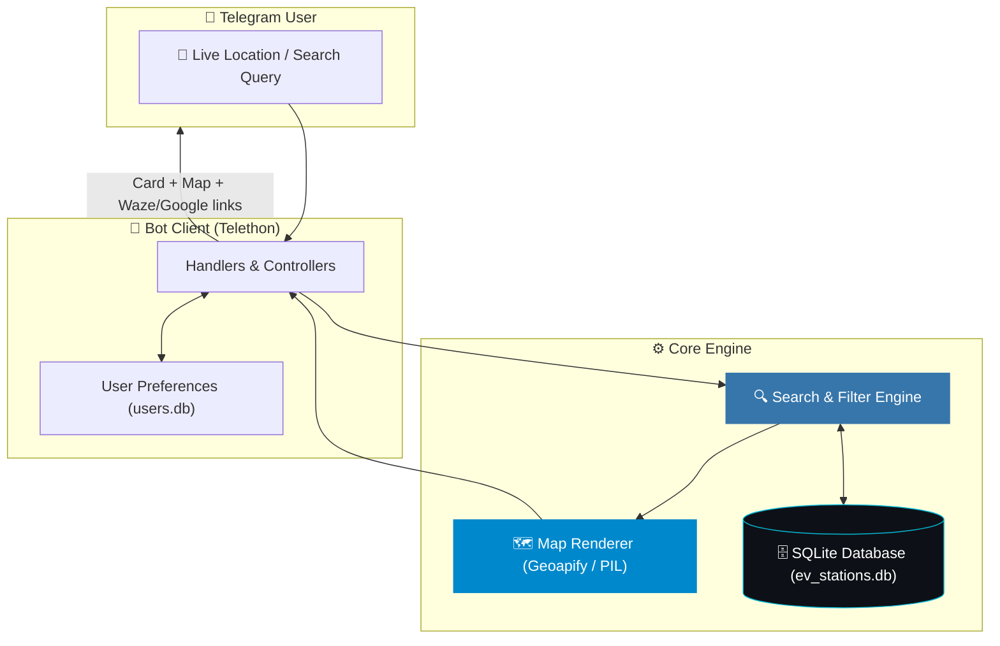
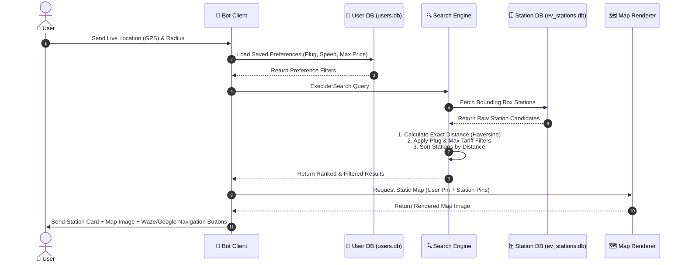
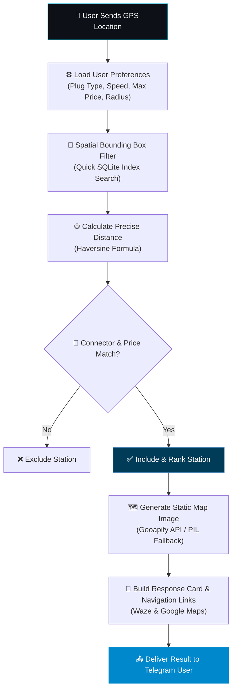

<div align="center">

# ⚡ EV Charging IL Bot
### Smart EV Station Search & Interactive Navigation in Israel

**Consolidated database of ~3,400 EV charging sites across all major operators in Israel.**<br>
Visual map rendering, smart plug/speed filters, real-time availability, and one-click Waze/Google Maps navigation.

<br>

🌐 **[עברית](README.he.md)** | **English**

<br><br>

<a href="#-quick-start"></a>
<a href="#-features"></a>
<a href="#-architecture"></a>
<a href="#-search--filtering-flow"></a>

<br><br>


</div>

---

## 📑 Table of Contents

<table>
<tr>
<td valign="top">

**Getting Started**
* [✨ Features](#-features)
* [🧠 Architecture](#-architecture)
* [🔍 Search & Filtering Flow](#-search--filtering-flow)
* [🗄️ Data Sources](#️-data-sources)

</td>
<td valign="top">

**Usage & Setup**
* [🚀 Quick Start](#-quick-start)
* [⚙️ Configuration](#️-configuration)
* [🗺️ Map Engine](#️-map-engine)

</td>
<td valign="top">

**Project Info**
* [🛡️ Privacy](#️-privacy)
* [📄 License](#-license)

</td>
</tr>
</table>

---

## ✨ Features

<table>
<tr>
<td width="33%" valign="top">

### 🔌 Complete Station Info
Exact distance, full address, operator, connector types (CCS2, Type 2, CHAdeMO), kW power output, kWh pricing, and real-time status.

</td>
<td width="33%" valign="top">

### 🗺️ Visual Map Renders
Dynamic map images generated around your GPS location. Your position is marked with a red pin and nearby stations with green lightning icons.

</td>
<td width="33%" valign="top">

### 🚗 One Click Navigation
Direct launch buttons for Waze and Google Maps to navigate straight to the selected charging point.

</td>
</tr>
<tr>
<td valign="top">

### ⚙️ Personalized Preferences
Saved user settings for preferred plug type, charging speed, search radius (10, 20, 40, 100 km), and maximum tariff filters.

</td>
<td valign="top">

### 🏛️ Official Verification
Visual "Ministry of Energy Verified" badges on official national registry station listings.

</td>
<td valign="top">

### 🗄️ 5 Source Consolidation
Idempotent data pipeline merging 5 independent registries into a clean, deduplicated SQLite database.

</td>
</tr>
</table>

---

## 🧠 Architecture

The system consists of a Telegram bot client, a station search & map rendering engine, and an offline data build pipeline.

| Component | Technology | Role |
|:---|:---|:---|
| 🤖 **Telegram Bot** | `Telethon` (Python 3.11) | User interaction, location handling, inline keyboards |
| 🔍 **Search Engine** | `Haversine` formula | Distance calculation and multi-criteria filtering |
| 🗺️ **Map Renderer** | `Geoapify` API / `PIL` | Generating map images with custom pins and overlays |
| 💾 **Storage Layer** | `SQLite` | User preference persistence (`users.db`) |
| 🛠️ **Data Builder** | `Python` pipeline | Scrapes, merges, and cleans data from 5 sources (`ev_stations.db`) |



---

## 🔍 Search & Filtering Flow

The sequence diagram below illustrates how user requests move through preference lookup, spatial indexing, distance ranking, map generation, and message delivery.





---

## 🗄️ Data Sources

The database consolidates 5 independent registries into a unified dataset:

| Source | Type | Description & Contribution |
|:---|:---|:---|
| **CelloCharge** | OCPI Registry | Ministry of Energy official backbone (~3,180 sites), tariffs, real-time status |
| **data.gov.il** | Open Data Portal | Government official dataset for verification and unique sites |
| **auto.co.il** | EV Community | Hebrew site names, address enrichment, and charger specs |
| **evm.co.il** | Community Map | Fast DC stations, AC chargers, and Tesla Superchargers |
| **Paz Charge / Yellow** | Corporate Network | 123 ultra-fast DC charging stations across Israel |

---

## 🚀 Quick Start

```bash
# 1 · Create and activate virtual environment
python3.11 -m venv ~/venvs/ev-bot && source ~/venvs/ev-bot/bin/activate

# 2 · Install dependencies
pip install -r requirements.txt

# 3 · Setup environment configuration
cp .env.example .env

# 4 · Build database
python data/build_db.py

# 5 · Run the bot
python -m bot.main
```

<details>
<summary><b>⚙️ &nbsp;What goes in <code>.env</code></b></summary>

<br>

| Variable | Description |
|:---|:---|
| `TELEGRAM_API_ID` | Telegram API ID from [my.telegram.org](https://my.telegram.org) |
| `TELEGRAM_API_HASH` | Telegram API Hash from [my.telegram.org](https://my.telegram.org) |
| `BOT_TOKEN` | Telegram Bot Token from [@BotFather](https://t.me/BotFather) |
| `GEOAPIFY_KEY` | Optional Geoapify API Key for static maps (fallback to PIL/OSM if blank) |

</details>

---

## 🗺️ Map Engine

Static maps are generated dynamically using Geoapify Static Maps API (`osm-carto` style with full Hebrew label rendering). If no API key is specified, the bot automatically switches to an offline OpenStreetMap tile overlay rendered using PIL.

---

## 🛡️ Privacy

* Location data is used strictly for immediate distance calculation during active searches and is never saved.
* No user tracking or behavioral analytics.
* Personal preferences are stored locally in `users.db`.

---

## 📄 License

MIT
