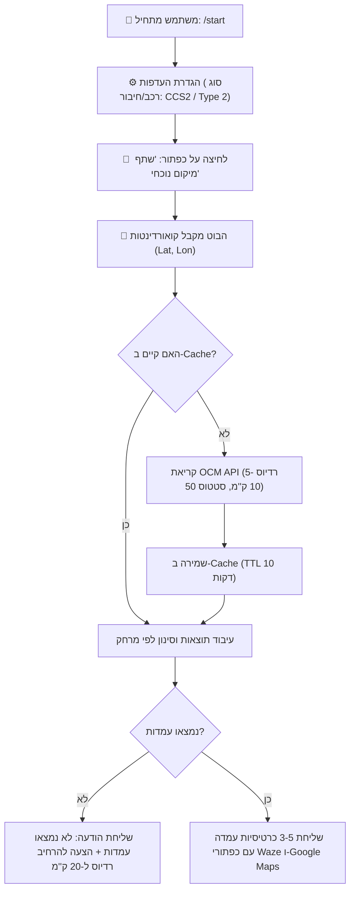

# 🔌 דוח מחקר טכני: אינטגרציה ותשתית לבוט עמדות טעינה לרכב חשמלי בישראל

**פרויקט:** בוט טלגרם לחיפוש עמדות טעינה (EV Charging Stations Bot)  
**תאריך:** אוגוסט 2026  
**נתיב קובץ:** `/home/vm/projects/ev-charging-bot/research/03-technical-integration.md`  
**סטטוס:** הושלם ואומת טכנית ✅  

---

## תוכן עניינים
1. [סקירת תקני מחברים ושכיחותם בישראל](#1-סקירת-תקני-מחברים-ושכיחותם-בישראל)
2. [אינטגרציה מול Open Charge Map (OCM) API](#2-אינטגרציה-מול-open-charge-map-ocm-api)
3. [ממשק Telegram Bot API — מיקום וניווט](#3-ממשק-telegram-bot-api--מיקום-וניווט)
4. [פורמטים מדויקים לקישורי ניווט (Deep Links)](#4-פורמטים-מדויקים-לקישורי-ניווט-deep-links)
5. [תשתית טכנולוגית מומלצת בפייתון](#5-תשתית-טכנולוגית-מומלצת-בפייתון)
6. [ארכיטקטורה והמלצות קונקרטיות למימוש ה-MVP](#6-ארכיטקטורה-והמלצות-קונקרטיות-למימוש-ה-mvp)

---

## 1. סקירת תקני מחברים ושכיחותם בישראל

שוק הרכב החשמלי בישראל מיושר באופן כמעט מוחלט עם התקינה האירופית (Directives של האיחוד האירופי שאומצו ע"י משרד התחבורה ומשרד האנרגיה). להלן סקירת שלושת המחברים המרכזיים:

```
+-------------------------------------------------------------------------------+
|                             תקני טעינה בישראל                                  |
+--------------------------+----------------------------+-----------------------+
|  CCS2 (DC מהיר)          |  Type 2 Mennekes (AC רגיל) |  CHAdeMO (DC ישן)    |
|  🟢 >95% מעמדות ה-DC     |  🟢 100% מעמדות ה-AC       |  🔴 <5% והולך ונעלם   |
|  ⚡ 50kW - 350kW+        |  ⚡ 3.7kW - 22kW           |  ⚡ עד 50kW           |
+--------------------------+----------------------------+-----------------------+
```

### פירוט המחברים

| תקן ומחבר | סוג זרם והספק | שכיחות ונתח שוק בישראל | מודלים נפוצים בישראל | שמות תצוגה מומלצים בעברית בבוט |
| :--- | :--- | :--- | :--- | :--- |
| **CCS2**<br>*(Combined Charging System 2)* | **DC (מהיר / אולטרה-מהיר)**<br>50kW – 350kW+ | **שולט באופן מוחלט (>95%)**<br>התקן המחייב בישראל לכל עמדת DC מהירה ציבורית חדשה. | טסלה (Model 3/Y/אירופי), BYD, ג'ילי, יונדאי (Ioniq 5/6), קיה (EV6/EV9), צ'רי, MG, פולקסווגן, זיקר, אקספנג וכו'. | • ⚡ **טעינה מהירה (CCS2)**<br>• **מהיר DC (CCS Combo 2)** |
| **Type 2**<br>*(Mennekes / IEC 62196-2)* | **AC (רגיל / איטי / יעד)**<br>3.7kW – 22kW (תלת-פאזי 32A) | **שולט באופן בלעדי (100%)**<br>התקן הבלעדי לטעינת AC ביתית וציבורית (עמדות יעד בחניונים, קניונים, מלונות). | **כל** רכב חשמלי ורכב היברידי-נטען (PHEV) הנמכר בישראל כולל כניסת Type 2. | • 🔌 **טעינה רגילה / AC (Type 2)**<br>• **טעינת AC (עד 22kW)** |
| **CHAdeMO** | **DC (מהיר תקן יפני)**<br>לרוב עד 50kW | **שכיחות נמוכה מאד (<5%) ובמגמת דעיכה**<br>עמדות חדשות אינן מותקנות עם CHAdeMO. נותר ככבל משני בעמדות 50kW משולבות ישנות. | ניסאן ליף (דור 1–2), מיצובישי אאוטלנדר PHEV ישן, לקסוס UX300e מוקדם. | • 🇯🇵 **טעינה מהירה יפנית (CHAdeMO)**<br>• **CHAdeMO (ניסאן ליף / ישן)** |

> **המלצה לממשק הבוט:** בברירת מחדל, יש להציע חיפוש עבור **CCS2** (עבור מי שמחפש טעינה מהירה בדרכים) ו-**Type 2** (עבור טעינת חניה ממושכת). יש לאפשר למשתמש להגדיר בפרופיל האישי שלו את סוג הרכב/החיבור המועדף עליו.

---

## 2. אינטגרציה מול Open Charge Map (OCM) API

**Open Charge Map** הוא מאגר הנתונים הגלובלי הפתוח הגדול ביותר למיפוי עמדות טעינה.

### דרישת מפתח API (Authentication)
החל מגרסה 3, ה-API דורש מפתח חינמי (API Key) שמופק לאחר רישום מהיר באתר `openchargemap.org`.  
את המפתח ניתן להעביר בשתי דרכים:
1. **Header מומלץ:** `X-API-Key: YOUR_API_KEY`
2. **Query Parameter:** `?key=YOUR_API_KEY`

---

### מזהי שדות (Reference Data IDs) ב-OCM

מתוך ה-Endpoint הרשמי `https://api.openchargemap.io/v3/referencedata/`:

#### מזהי סוגי מחברים (`connectiontypeid`)
* `33` = **CCS (Type 2)** *(הנפוץ ביותר ל-DC)*
* `25` = **Type 2 (Socket Only)** *(עמדת AC שדורשת כבל משתמש)*
* `1036` = **Type 2 (Tethered Connector)** *(עמדת AC עם כבל מחובר מראש)*
* `2` = **CHAdeMO** *(טעינה מהירה תקן יפני)*
* `32` = **CCS (Type 1)** *(תקן אמריקאי - נדיר בישראל, יבוא אישי בלבד)*

#### מזהי סטטוס תפעולי (`statustypeid`)
* `50` = **Operational** (עמדה פעילה ותקינה)
* `100` = **Not Operational** (מושבתת / תקולה)
* `150` = **Planned For Future Date** (בתכנון / טרם הוקמה)
* `0` = **Unknown** (לא ידוע)

---

### דוגמאות URL מלאות ושאילתות לביצוע

#### 1. חיפוש עמדות מהירות (CCS2 מעל 50kW) ברדיוס 5 ק"מ מקואורדינטות בתל אביב:
```http
GET https://api.openchargemap.io/v3/poi/?output=json&latitude=32.0853&longitude=34.7818&distance=5&distanceunit=KM&countrycode=IL&statustypeid=50&minpowerkw=50&connectiontypeid=33&maxresults=10&compact=true&key=YOUR_API_KEY
```

#### 2. חיפוש כללי של כל העמדות הפעילות ברדיוס 10 ק"מ:
```http
GET https://api.openchargemap.io/v3/poi/?output=json&latitude=32.0853&longitude=34.7818&distance=10&distanceunit=KM&countrycode=IL&statustypeid=50&maxresults=15&compact=true&key=YOUR_API_KEY
```

---

### מבנה תגובת JSON טיפוסית (POI Object)

```json
[
  {
    "ID": 194582,
    "UUID": "A1B2C3D4-E5F6-7890-ABCD-1234567890AB",
    "DataProviderID": 1,
    "OperatorInfo": {
      "ID": 345,
      "Title": "Afcon EV",
      "WebsiteURL": "https://www.afcon-ev.co.il",
      "PhonePrimaryContact": "*6522",
      "IsPrivateIndividual": false
    },
    "UsageType": {
      "ID": 1,
      "Title": "Public",
      "IsPayAtLocation": true
    },
    "StatusType": {
      "ID": 50,
      "Title": "Operational",
      "IsOperational": true
    },
    "AddressInfo": {
      "ID": 194939,
      "Title": "קניון עזריאלי תל אביב",
      "AddressLine1": "דרך מנחם בגין 132",
      "Town": "תל אביב",
      "Postcode": "6701101",
      "CountryID": 109,
      "Latitude": 32.074444,
      "Longitude": 34.791667,
      "AccessComments": "חניון מינוס 1 ליד עמודות 14-16",
      "Distance": 1.42,
      "DistanceUnit": 1
    },
    "Connections": [
      {
        "ID": 317890,
        "ConnectionTypeID": 33,
        "ConnectionType": {
          "ID": 33,
          "Title": "CCS (Type 2)"
        },
        "StatusTypeID": 50,
        "LevelID": 3,
        "PowerKW": 150.0,
        "CurrentTypeID": 30,
        "Quantity": 2
      },
      {
        "ID": 317891,
        "ConnectionTypeID": 25,
        "ConnectionType": {
          "ID": 25,
          "Title": "Type 2 (Socket Only)"
        },
        "StatusTypeID": 50,
        "LevelID": 2,
        "PowerKW": 22.0,
        "CurrentTypeID": 20,
        "Quantity": 4
      }
    ],
    "NumberOfPoints": 6,
    "DateLastStatusUpdate": "2026-07-15T12:30:00Z",
    "DateLastVerified": "2026-08-01T09:15:00Z"
  }
]
```

---

### ⚠️ הבהרה קריטית: זמינות בזמן אמת (Live Occupancy Status)
* **Open Charge Map הוא Registry סטטי וקהילתי**: הוא מציין האם עמדה קיימת, פעילה מבחינה תפעולית (`StatusTypeID=50`), מה הספקה ואילו שקעים יש בה.
* **אין ב-OCM זמינות חיה של תפוס/פנוי (Occupied/Available)** ברמת השניה הבודדת ללא חיבור לפרוטוקול OCPI ישיר מול מפעילי העמדות (CPOs).
* **פתרון משלים ל-MVP ולשלב הבא:**
  1. הצגת נתוני הסטטוס התפעולי, סוג החיבור, ההספק והמפעיל מ-OCM.
  2. הצגת כפתור ישיר לאפליקציית המפעיל / CelloCharge / Waze.
  3. אינטגרציה עתידית מול ה-API של משרד האנרגיה (מערכת המידע הלאומית שמרכזת נתוני OCPI מחברות הטעינה בישראל).

---

## 3. ממשק Telegram Bot API — מיקום וניווט

### 1. בקשת מיקום מהמשתמש (Request Location)
כדי לקבל את ה-GPS המדויק של המשתמש בסמארטפון, משתמשים ב-`ReplyKeyboardMarkup` המכיל כפתור מיוחד עם `"request_location": true`.

#### קריאת API יוצאת מהבוט (`sendMessage`):
```json
{
  "chat_id": 123456789,
  "text": "📍 *כדי למצוא את עמדות הטעינה הקרובות אליך, אנא שתף את מיקומך:*",
  "parse_mode": "MarkdownV2",
  "reply_markup": {
    "keyboard": [
      [
        {
          "text": "📍 שתף מיקום נוכחי",
          "request_location": true
        }
      ],
      [
        {
          "text": "❌ ביטול"
        }
      ]
    ],
    "resize_keyboard": true,
    "one_time_keyboard": true
  }
}
```

#### מבנה ה-Update הנכנס מהמשתמש בטלגרם:
```json
{
  "update_id": 987654321,
  "message": {
    "message_id": 55,
    "from": {
      "id": 123456789,
      "is_bot": false,
      "first_name": "ישראל",
      "language_code": "he"
    },
    "chat": {
      "id": 123456789,
      "type": "private"
    },
    "date": 1724500000,
    "location": {
      "latitude": 32.085299,
      "longitude": 34.781768,
      "horizontal_accuracy": 14.5
    }
  }
}
```

---

### 2. שליחת מיקום עמדה למשתמש (`sendVenue` ו-`sendLocation`)

כאשר מחזירים למשתמש את תוצאות החיפוש, ניתן לשלוח מפה אינטראקטיבית בטלגרם.

#### שימוש מומלץ ב-`sendVenue` (כולל כותרת וכתובת מוצמדים לנעץ):
```json
{
  "chat_id": 123456789,
  "latitude": 32.074444,
  "longitude": 34.791667,
  "title": "עמדת טעינה Afcon — עזריאלי",
  "address": "דרך מנחם בגין 132, תל אביב (150kW DC)",
  "reply_markup": {
    "inline_keyboard": [
      [
        {
          "text": "🚗 נווט ב-Waze",
          "url": "https://waze.com/ul?ll=32.074444,34.791667&navigate=yes"
        },
        {
          "text": "🗺️ Google Maps",
          "url": "https://www.google.com/maps/search/?api=1&query=32.074444,34.791667"
        }
      ],
      [
        {
          "text": "ℹ️ פרטי מחברים והספקים",
          "callback_data": "station_details_194582"
        }
      ]
    ]
  }
}
```

---

### 3. מגבלות, טיפים ואתגרים ב-Telegram API

1. **הבדל בין Mobile ל-Desktop/Web:**
   * באפליקציות מובייל (iOS / Android), לחיצה על כפתור `request_location` משתמשת ברכיב ה-GPS ומחזירה מיקום ברמת דיוק גבוהה (`horizontal_accuracy < 20m`).
   * ב-Telegram Desktop / Web, המשתמש נדרש לבחור ידנית מיקום על גבי מפה צצה (או שהכפתור אינו זמין). יש להציע fallback של הקלדת שם עיר או כתובת.
2. **הסרת המקלדת הצפה (`ReplyKeyboardRemove`):**
   * לאחר שהמשתמש שלח מיקום, יש להחזיר את המקלדת למצב רגיל באמצעות `one_time_keyboard: true` או שליחת הודעת ביטול מקלדת כדי לא לחסום חצי מסך.
3. **פרטיות ועיבוד נתונים:**
   * אין לשמור קואורדינטות מדויקות של משתמש בבסיס נתונים ללא צורך מפורש.
   * מומלץ לעגל קואורדינטות (למשל ל-3 ספרות עשרוניות ~ 110 מטר) לצורכי Caching ושמירה על פרטיות.

---

## 4. פורמטים מדויקים לקישורי ניווט (Deep Links)

כדי לאפשר לנהג לפתוח את אפליקציית הניווט בלחיצה אחת מתוך טלגרם, חובה להשתמש בקישורי HTTPS Universal Links (כיוון שטלגרם תומכת אך ורק ב-URL מסוג `http://` או `https://` בתוך `InlineKeyboardButton`).

```
+-----------------------------------------------------------------------------------------+
|                                    קישורי ניווט ישירים                                  |
+-------------+---------------------------------------------------------------------------+
| Waze        | https://waze.com/ul?ll=LAT,LNG&navigate=yes                               |
| Google Maps | https://www.google.com/maps/search/?api=1&query=LAT,LNG                  |
| Apple Maps  | https://maps.apple.com/?daddr=LAT,LNG                                     |
+-------------+---------------------------------------------------------------------------+
```

### 1. Waze
* **Universal Web Link (נתמך ישירות ב-Inline Keyboard):**
  ```text
  https://waze.com/ul?ll=LATITUDE,LONGITUDE&navigate=yes
  ```
  * **דוגמה חיה:**
    `https://waze.com/ul?ll=32.074444,34.791667&navigate=yes`
  * **התנהגות:** במכשיר נייד פותח מיד את אפליקציית Waze ומתחיל מסלול ניווט. בדסקטופ פותח את אתר Waze Live Map.

---

### 2. Google Maps
* **Cross-Platform Search & Display URL (תקן רשמי של Google Maps URLs):**
  ```text
  https://www.google.com/maps/search/?api=1&query=LATITUDE,LONGITUDE
  ```
  * **דוגמה חיה:**
    `https://www.google.com/maps/search/?api=1&query=32.074444,34.791667`
* **Direct Navigation / Directions Mode URL:**
  ```text
  https://www.google.com/maps/dir/?api=1&destination=LATITUDE,LONGITUDE
  ```
  * **דוגמה חיה:**
    `https://www.google.com/maps/dir/?api=1&destination=32.074444,34.791667`

---

### 3. Apple Maps (אופציונלי למשתמשי iPhone)
* **URL Scheme:**
  ```text
  https://maps.apple.com/?daddr=LATITUDE,LONGITUDE
  ```
  * **דוגמה חיה:**
    `https://maps.apple.com/?daddr=32.074444,34.791667`

---

## 5. תשתית טכנולוגית מומלצת בפייתון

### השוואת ספריות טלגרם: `aiogram 3.x` מול `python-telegram-bot 21.x`

| פרמטר | `aiogram` (גרסה 3.15+) | `python-telegram-bot` (גרסה 21.x) |
| :--- | :--- | :--- |
| **ארכיטקטורה** | `asyncio` טבעי מהיסוד, מבוסס Dispatcher & Routers מודולריים | מבוסס `ApplicationBuilder` ו-Handlers (תמיכה מלאה ב-async מגרסה 20) |
| **ביצועים ומשקל** | ביצועים גבוהים במיוחד, עיבוד אסינכרוני מהיר, צריכת זיכרון נמוכה | מעט כבדה יותר, אך חזקה ויציבה מאד |
| **ניהול שיחה (FSM / States)** | מערכת FSM מודרנית וגמישה (תמיכה מובנית ב-Memory וב-Redis Storage) | `ConversationHandler` קלאסי ומובנה |
| **תמיכה ב-Typing ו-Pydantic** | שימוש מלא ב-Pydantic v2 לכל האובייקטים והאימותים | אובייקטי Python מותאמים אישית (Dataclasses-like) |
| **עקומת למידה** | בינונית (דורשת הבנה טובה ב-asyncio וארכיטקטורת Routers) | קלה-בינונית (תיעוד עשיר מאד עם אינספור דוגמאות) |
| **המלצה לפרויקט זה** | ⭐ **הבחירה המומלצת לביצועים וגמישות מודרנית** | ⭐ **בחירה מצוינת אם מעדיפים מבנה קלאסי ומיושב** |

---

### ספריות HTTP: למה `httpx`?
* **`httpx` (גרסה 0.27+)**: הבחירה המומלצת ביותר.
  * מספקת `httpx.AsyncClient` שאינו חוסם את ה-Event Loop של הבוט.
  * תומכת ב-HTTP/2 וב-Connection Pooling.
  * תחביר זהה ואינטואיטיבי כמו `requests`.
* **`aiohttp`**: מצוינת ומהירה, אך התחביר שלה מרובה `async with` ומסורבל מעט יותר.
* ⚠️ **`requests`**: **אסור לשימוש** ישיר בתוך Handlers אסינכרוניים כיוון שהיא חוסמת את ה-Thread הראשי ופוגעת בזמן התגובה לכל שאר המשתמשים.

---

### ניהול זיכרון מטמון (Caching) ומגבלות קצב (Rate Limiting)
כדי לא להעמיס על ה-API של Open Charge Map ולהבטיח זמני תגובה של מילישניות:
1. **עיגול קואורדינטות (Geohash / Rounding):**
   * עיגול ל-3 ספרות עשרוניות (`round(lat, 3)`, `round(lon, 3)`) מייצג תא גיאוגרפי של כ-110 מטר.
2. **שימוש ב-`cachetools.TTLCache` או `aiocache`:**
   * שמירת תוצאות חיפוש בזיכרון ל-10–15 דקות. אם משתמש נוסף מחפש באותו אזור, התשובה מוחזרת מיד מה-Cache.

---

## 6. ארכיטקטורה והמלצות קונקרטיות למימוש ה-MVP

### תרשים זרימת המשתמש (User Flow)



---

### תבנית הודעת תוצאה מעוצבת למשתמש

```text
⚡ נמצאו 3 עמדות טעינה קרובות אליך:

1️⃣ עמדת אפקון — קניון עזריאלי
📍 תל אביב, דרך מנחם בגין 132
📏 מרחק: 1.2 ק"מ ממך
⚡ הספק מרבי: 150 קו"ט (DC אולטרה-מהיר)
🔌 חיבורים: 2x CCS2 | 4x Type 2 (22kW)
🟢 סטטוס: פעיל ומאומת

[ 🚗 נווט ב-Waze ]  [ 🗺️ Google Maps ]
-----------------------------------------
2️⃣ עמדת EV-Edge — מגדלי תוצרת הארץ
📍 תל אביב, תוצרת הארץ 6
📏 מרחק: 1.8 ק"מ ממך
⚡ הספק מרבי: 50 קו"ט (DC מהיר)
🔌 חיבורים: 2x CCS2
🟢 סטטוס: פעיל

[ 🚗 נווט ב-Waze ]  [ 🗺️ Google Maps ]
```

---

### מבנה קבצים מומלץ לקוד הבוט (Modular Project Layout)

```
ev-charging-bot/
├── bot/
│   ├── __init__.py
│   ├── main.py                  # נקודת כניסה ראשית (Entrypoint)
│   ├── config.py                # טעינת משתני סביבה (.env) עם Pydantic Settings
│   ├── handlers/
│   │   ├── __init__.py
│   │   ├── common.py            # /start, /help, /settings
│   │   ├── location.py          # טיפול באירועי קבלת מיקום (Location Message)
│   │   └── callbacks.py         # טיפול בלחיצות כפתורי Inline
│   ├── keyboards/
│   │   ├── reply.py             # מקלדת שיתוף מיקום (request_location)
│   │   └── inline.py            # כפתורי ניווט (Waze, Google Maps)
│   └── services/
│       ├── __init__.py
│       ├── ocm_client.py        # קליינט אסינכרוני מול Open Charge Map (HTTPX)
│       ├── cache_service.py     # ניהול Caching ו-TTLCache
│       └── formatters.py        # עיצוב הודעות בעברית, חישוב מרחקים
├── research/
│   └── 03-technical-integration.md
├── requirements.txt
├── .env.example
└── README.md
```

---

### חבילות פייתון נדרשות לקובץ `requirements.txt`
```text
aiogram>=3.15.0
httpx>=0.27.0
pydantic-settings>=2.4.0
cachetools>=5.5.0
python-dotenv>=1.0.1
geopy>=2.4.1
```

---

## 7. סיכום תובנות מרכזיות למימוש מיידי
1. **חיבורים:** יש להתמקד ב-**CCS2** (עבור מהיר) ו-**Type 2** (עבור איטי/יעד). CHAdeMO נדרש רק כפילטר שולי.
2. **API:** מפתח חינמי ל-Open Charge Map חובה לקריאות API; יש לשמור תשובות ב-Cache למניעת עומס.
3. **טלגרם:** שיתוף מיקום מבוצע באמצעות `request_location=True` ב-`ReplyKeyboardMarkup`, ותוצאות מוחזרות עם קישורי HTTPS ישירים ל-Waze ו-Google Maps.
4. **תשתית:** `aiogram 3.x` בשילוב `httpx.AsyncClient` מספקים ביצועים מעולים, קוד נקי ותמיכה מלאה ב-Asyncio.
