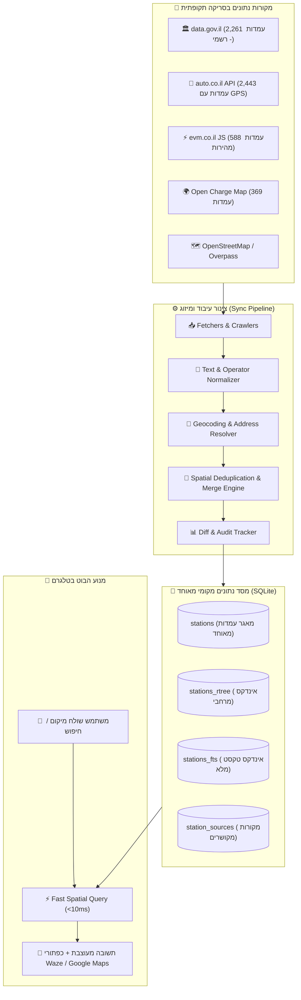
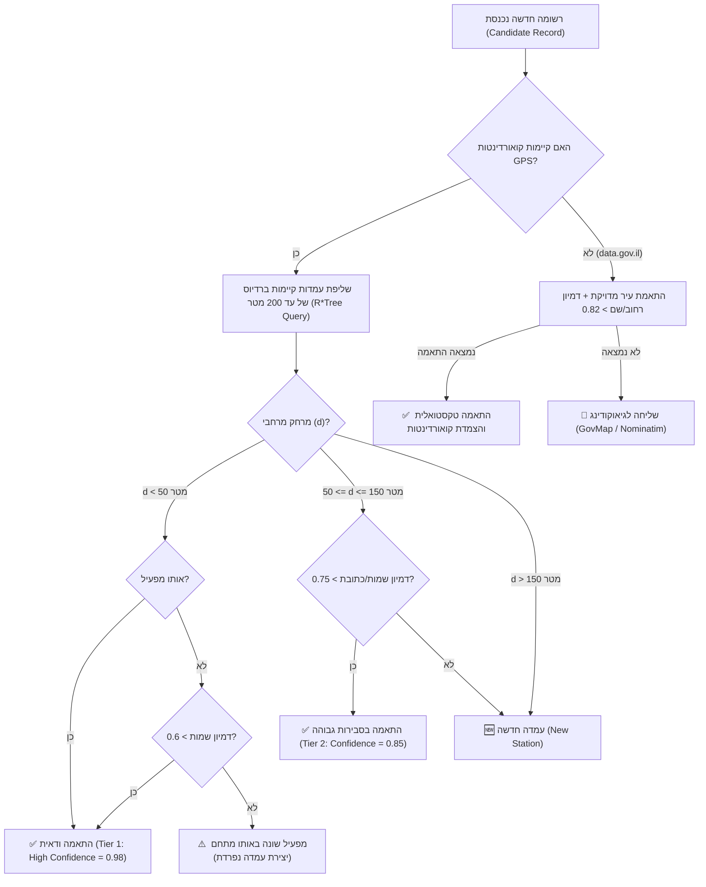
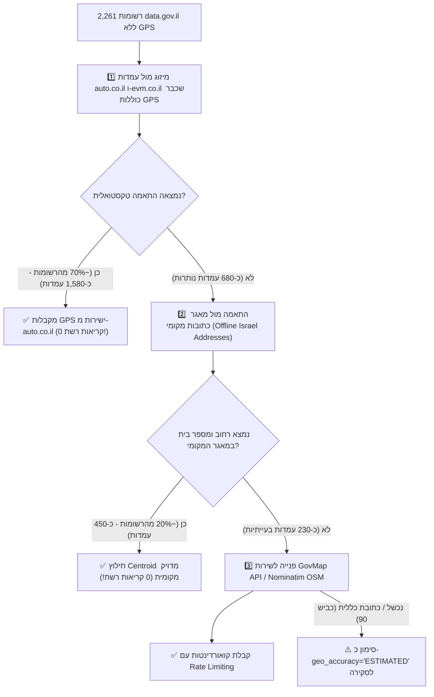

# 🏗️ ארכיטקטורת מנגנון מחקר וסריקה תקופתית (Periodic Crawl & Data Merging)
## בוט טלגרם לאיתור עמדות טעינה לרכב חשמלי בישראל

**מסמך ארכיטקטורה ותכנון נתונים ראשי (Data Architecture Specification)**  
**נתיב קובץ:** `/home/vm/projects/ev-charging-bot/research/05-crawl-architecture.md`  
**תאריך:** אוגוסט 2026  
**סטטוס:** מאושר לתכנון וביצוע (Production Ready) 🚀  

---

## תוכן עניינים
1. [תקציר מנהלים ותפיסת הארכיטקטורה](#1-תקציר-מנהלים-ותפיסת-הארכיטקטורה)
2. [סקירת מקורות הנתונים לסריקה ומיזוג](#2-סקירת-מקורות-הנתונים-לסריקה-ומיזוג)
3. [סכמת מסד נתונים מקומי (SQLite + Spatial Index)](#3-סכמת-מסד-נתונים-מקומי-sqlite--spatial-index)
4. [אסטרטגיית מיזוג, נרמול ודדופליקציה (Deduplication Engine)](#4-אסטרטגיית-מיזוג-נרמול-ודדופליקציה-deduplication-engine)
5. [מנגנון גיאוקודינג היברידי (Geocoding Pipeline)](#5-מנגנון-גיאוקודינג-היברידי-geocoding-pipeline)
6. [תדירות, אוטומציה ובקרת שינויים (Sync, Diffing & Automation)](#6-תדירות-אוטומציה-ובקרת-שינויים-sync-diffing--automation)
7. [מנוע שאילתות וחיפוש מתקדם בבוט](#7-מנוע-שאילתות-וחיפוש-מתקדם-בבוט)
8. [אתגרים, סיכונים ותוכנית התמודדות](#8-אתגרים-סיכונים-ותוכנית-התמודדות)
9. [תוכנית עבודה ליישום מיידי (Action Plan)](#9-תוכנית-עבודה-ליישום-מיידי-action-plan)

---

## 1. תקציר מנהלים ותפיסת הארכיטקטורה

### 1.1 רציונל: מדוע "סריקה תקופתית" עדיפה על API חי בזמן אמת?
הנחת היסוד של הפרויקט מבוססת על המציאות הפיזית והטכנולוגית של שוק הרכב החשמלי בישראל:
1. **עמדות טעינה הן תשתית פיזית קבועה:** עמדות אינן נעלמות בן-לילה. הקמת עמדה דורשת אישורי חברת חשמל, חפירות ותשתיות יקרות. רוב השינויים הם **תוספת עמדות חדשות**, **שדרוג הספקים** (מעבר מ-50kW ל-150kW+) או **הוספת שקעים**.
2. **אפס תלות ב-APIs חיצוניים איטיים בזמן שאילתת משתמש:** שאילתה מול שרתי צד-שלישי בזמן אמת בטלגרם מייצרת זמני השהיה (Latency) של 1.5–4 שניות, חשיפה לחסימות (Rate Limits), ונפילות שירות.
3. **ביצועים מקסימליים ועלות אפס:** אחסון כלל העמדות בישראל במסד נתונים מקומי מהיר (SQLite) מאפשר מענה תוך **פחות מ-15 מילישניות** לשאילתת רדיוס, 100% שרידות אופליין, ואפס עלויות תשתית ענן חודשיות.
4. **עושר מידע באמצעות איחוד מקורות (Best of all worlds):** שום מקור נתונים יחיד בישראל אינו מושלם:
   - המאגר הממשלתי (`data.gov.il`) כולל את הכיסוי הרשמי המקיף ביותר אך **ללא קואורדינטות GPS**.
   - אתר `auto.co.il` מספק קואורדינטות GPS מלאות ושמות מתחמים מעודכנים.
   - אתר `evm.co.il` כולל מיפוי מדויק של עמדות DC מהירות ואולטרה-מהירות.
   - מאגרי `Open Charge Map` ו-`OSM` מוסיפים פירוט טכני של סוגי תקעים.



---

## 2. סקירת מקורות הנתונים לסריקה ומיזוג

להלן ניתוח כמותי ומבני של 5 מקורות המידע שנבדקו ואומתו בפועל:

| מקור נתונים | כמות רשומות מאומתת | פורמט שליפה | קואורדינטות GPS | חוזקות מרכזיות | חולשות / פערים |
| :--- | :--- | :--- | :--- | :--- | :--- |
| **data.gov.il** (`agg_charge_stations`) | **2,261** | CKAN REST JSON | ❌ חסר (כתובת טקסט בלבד) | מאגר רשמי של משרד האנרגיה, כולל חלוקת מהיר/איטי ושם מפעיל חוקי | אין Lat/Lng ישיר, שמות כתובת כלליים (למשל: "כביש 90") |
| **auto.co.il** (`/api/chargingStations/map/stations`) | **2,443** | REST JSON ישיר | ✅ כן (Lat / Lng מדויק) | פריסה רחבה ביותר, שמות עבריים מצוינים, קטלוג חברות | דורש פרמטר `cultureCode=he-IL`, חלוקה כללית ל-regular/fast |
| **evm.co.il** (`CM.*.min.js`) | **588** | JS Array (Base64 URL-encoded) | ✅ כן (Lat / Lng מדויק) | מיקוד בעמדות DC מהירות ואולטרה-מהירות, הספקים גבוהים | מכיל עמדות מהירות בלבד, דורש פענוח JS |
| **Open Charge Map (OCM)** | **369** | REST JSON (v3 POI API) | ✅ כן (Lat / Lng מדויק) | מפרט טכני עשיר: סוגי תקעים (CCS2/Type2), הספק ב-kW | כיסוי חלקי בישראל (~15% מהשוק) |
| **OpenStreetMap (OSM)** | **~180–300** | Overpass QL API | ✅ כן (Lat / Lng מדויק) | קהילתי, קוד פתוח (ODbL), כולל תגיות חניה וגישה | כיסוי דליל יחסית |

> **הערכת גודל המאגר המאוחד (Deduplicated Corpus):**  
> לאחר ניקוי כפילויות, המאגר המאוחד בישראל מכיל בין **2,700 ל-3,100 אתרי טעינה ייחודיים** (הכוללים מעל 7,000 שקעי טעינה).

---

## 3. סכמת מסד נתונים מקומי (SQLite + Spatial Index)

בסיס הנתונים מתוכנן ב-**SQLite 3** תוך שימוש במודולים המובנים:
1. **R*Tree Virtual Table** (`rtree`) לאינדוקס מרחבי דו-ממדי מהיר במיוחד (Bounding Box Queries).
2. **FTS5 Virtual Table** לחיפוש טקסטואלי מלא בעברית (שמות מתחמים, רחובות, ערים, חברות).
3. **JSON1** לאחסון גמיש של מפרטי תקעים ומטא-דאטה מקורי.

### 3.1 מבנה ה-DDL המלא (SQL)

```sql
-- הפעלת תמיכה במפתחות זרים וביצועי WAL
PRAGMA foreign_keys = ON;
PRAGMA journal_mode = WAL;
PRAGMA synchronous = NORMAL;

-- 1. טבלת מפעילי רשתות טעינה (Normalized CPOs)
CREATE TABLE IF NOT EXISTS operators (
    operator_id TEXT PRIMARY KEY,          -- קוד מזהה קנוני (למשל: AFCON, EV_EDGE, PAZ_CHARGE)
    display_name_he TEXT NOT NULL,         -- שם תצוגה בעברית ("אפקון תחבורה חשמלית")
    display_name_en TEXT,                  -- שם באנגלית ("Afcon EV")
    support_phone TEXT,                    -- טלפון מוקד שירות לקוחות
    app_waze_link TEXT,                    -- קישור ישיר לאפליקציה/מידע
    logo_url TEXT
);

-- 2. טבלת עמדות טעינה מאוחדת (Unified Stations)
CREATE TABLE IF NOT EXISTS stations (
    station_id TEXT PRIMARY KEY,           -- מזהה דטרמיניסטי מבוסס UUIDv5 (מבוסס מיקום+מפעיל)
    name TEXT NOT NULL,                    -- שם האתר ("קניון עזריאלי - חניון מינוס 1")
    operator_id TEXT REFERENCES operators(operator_id),
    operator_raw TEXT,                     -- שם המפעיל כפי שהתקבל במקור
    address_raw TEXT,                      -- כתובת מקורית מלאה
    city TEXT,                             -- שם עיר מנורמל ("תל אביב-יפו")
    street TEXT,                           -- שם רחוב ("דרך מנחם בגין")
    house_number TEXT,                     -- מספר בית ("132")
    
    -- קואורדינטות GPS (WGS84)
    latitude REAL NOT NULL,
    longitude REAL NOT NULL,
    geo_accuracy TEXT CHECK(geo_accuracy IN ('EXACT_GPS', 'ROOFTOP', 'STREET_CENTER', 'CITY_CENTER', 'ESTIMATED')),
    
    -- מאפייני טעינה
    total_ports INTEGER DEFAULT 1,         -- סך עמדות/שקעים באתר
    fast_ports_count INTEGER DEFAULT 0,    -- כמות עמדות מהירות (DC)
    slow_ports_count INTEGER DEFAULT 0,    -- כמות עמדות איטיות (AC)
    max_power_kw REAL DEFAULT NULL,        -- הספק מרבי באתר (למשל: 150.0)
    has_ccs2 BOOLEAN DEFAULT 0,            -- האם יש תקע CCS2
    has_type2 BOOLEAN DEFAULT 0,           -- האם יש תקע Type 2
    has_chademo BOOLEAN DEFAULT 0,         -- האם יש תקע CHAdeMO
    connectors_json TEXT DEFAULT '[]',     -- פירוט מלא של כל השקעים (JSON Array)
    
    -- אימות ומקורות
    is_gov_official BOOLEAN DEFAULT 0,     -- האם מופיע במאגר הרשמי של משרד האנרגיה
    confidence_score REAL DEFAULT 1.0,     -- ציון אמינות המיזוג (0.0 עד 1.0)
    sources_mask INTEGER DEFAULT 0,        -- Bitmask של מקורות (Bit 1: Gov, Bit 2: Auto, Bit 3: EVM, Bit 4: OCM, Bit 5: OSM)
    
    -- סטטוס פעילות ומעקב זמנים
    status TEXT DEFAULT 'active' CHECK(status IN ('active', 'temporarily_closed', 'decommissioned', 'unverified')),
    first_seen_at TIMESTAMP DEFAULT CURRENT_TIMESTAMP,
    last_synced_at TIMESTAMP DEFAULT CURRENT_TIMESTAMP,
    last_crawl_run_id TEXT
);

-- 3. טבלת מקורות מפורטת (Data Provenance & Lineage)
CREATE TABLE IF NOT EXISTS station_sources (
    station_id TEXT NOT NULL REFERENCES stations(station_id) ON DELETE CASCADE,
    source_name TEXT NOT NULL,             -- 'data_gov_il', 'auto_co_il', 'evm_co_il', 'ocm', 'osm'
    source_record_id TEXT NOT NULL,        -- המזהה המקורי במערכת המקור (למשל: auto.co.il id: 302186)
    source_payload JSON NOT NULL,          -- ה-JSON המקורי הגולמי
    synced_at TIMESTAMP DEFAULT CURRENT_TIMESTAMP,
    PRIMARY KEY (station_id, source_name)
);

-- 4. אינדקס מרחבי מבוסס R*Tree (RTree Index for Fast Bounding Box)
CREATE VIRTUAL TABLE IF NOT EXISTS stations_rtree USING rtree(
    id INTEGER PRIMARY KEY,                -- station_rowid (rowid מתוך טבלת stations)
    min_lat REAL, max_lat REAL,            -- Y min/max
    min_lon REAL, max_lon REAL             -- X min/max
);

-- 5. אינדקס חיפוש טקסט מלא בעברית (FTS5)
CREATE VIRTUAL TABLE IF NOT EXISTS stations_fts USING fts5(
    name,
    city,
    street,
    operator_name,
    address_raw,
    content='stations',
    content_rowid='rowid',
    tokenize='unicode61 remove_diacritics 2'
);

-- 6. טבלאות ניהול ריצות סריקה והיסטוריית שינויים (Audit & Diff Log)
CREATE TABLE IF NOT EXISTS crawl_runs (
    run_id TEXT PRIMARY KEY,
    started_at TIMESTAMP DEFAULT CURRENT_TIMESTAMP,
    ended_at TIMESTAMP,
    status TEXT DEFAULT 'running',         -- 'running', 'completed', 'failed'
    total_fetched INTEGER DEFAULT 0,
    total_merged INTEGER DEFAULT 0,
    new_stations_count INTEGER DEFAULT 0,
    updated_stations_count INTEGER DEFAULT 0,
    unchanged_stations_count INTEGER DEFAULT 0,
    stats_json JSON
);

CREATE TABLE IF NOT EXISTS crawl_diffs (
    diff_id INTEGER PRIMARY KEY AUTOINCREMENT,
    run_id TEXT REFERENCES crawl_runs(run_id),
    station_id TEXT REFERENCES stations(station_id),
    change_type TEXT CHECK(change_type IN ('INSERT', 'UPDATE', 'DEACTIVATE')),
    field_name TEXT,
    old_value TEXT,
    new_value TEXT,
    created_at TIMESTAMP DEFAULT CURRENT_TIMESTAMP
);

-- אינדקסים משלימים לשאילתות מהירות
CREATE INDEX IF NOT EXISTS idx_stations_operator ON stations(operator_id);
CREATE INDEX IF NOT EXISTS idx_stations_power ON stations(max_power_kw);
CREATE INDEX IF NOT EXISTS idx_stations_flags ON stations(has_ccs2, has_type2, is_gov_official);
CREATE INDEX IF NOT EXISTS idx_stations_status ON stations(status);
```

---

## 4. אסטרטגיית מיזוג, נרמול ודדופליקציה (Deduplication Engine)

### 4.1 שלב 1: נרמול שמות מפעילים (Operator Canonicalization)
שמות המפעילים מגיעים בצורות שונות. הצינור ממיר כל שם למזהה קנוני אחיד:

```python
OPERATOR_CANONICAL_MAP = {
    # Afcon
    "afconev": "AFCON", "afcon": "AFCON", "אפקון": "AFCON", "אפקון ev": "AFCON", "רשת on": "AFCON",
    # EV Edge
    "evedge": "EV_EDGE", "ev-edge": "EV_EDGE", "ev edge": "EV_EDGE", "איוי אדג": "EV_EDGE", "יוניון מוטורס": "EV_EDGE",
    # Paz Charge
    "pazcharge": "PAZ_CHARGE", "paz": "PAZ_CHARGE", "פז": "PAZ_CHARGE", "פז charge": "PAZ_CHARGE", "yellow": "PAZ_CHARGE",
    # Sonol EVI
    "sonolevi": "SONOL_EVI", "sonol": "SONOL_EVI", "סונול": "SONOL_EVI", "סונול evi": "SONOL_EVI",
    # Gnrgy
    "gnrgy": "GNRGY", "ג'ינרג'י": "GNRGY", "גינרגי": "GNRGY", "gnrgy go": "GNRGY",
    # Scala
    "scalaev": "SCALA_EV", "scala": "SCALA_EV", "סקאלה": "SCALA_EV", "scala energy": "SCALA_EV",
    # Greenspot
    "greenspot": "GREENSPOT", "גרינספוט": "GREENSPOT", "green spot": "GREENSPOT",
    # Enova
    "enova": "ENOVA", "אינובה": "ENOVA",
    # Nofar Energy
    "nofar": "NOFAR", "נופר": "NOFAR", "נופר אנרגיה": "NOFAR",
    # Tesla
    "tesla": "TESLA", "טסלה": "TESLA", "supercharger": "TESLA"
}
```

---

### 4.2 שלב 2: ניקוי ונרמול טקסט עברי
פונקציית ניקוי מסירה מילות "רעש" כגון "עמדת טעינה", "תחנת", "מטען", "חניון", סימני פיסוק ורווחים מיותרים כדי להשוות את ליבת שם האתר.

```python
import re

def normalize_hebrew_text(text: str) -> str:
    if not text:
        return ""
    text = text.lower()
    # הסרת מילות רעש
    noise_words = [
        r"\bעמדת טעינה\b", r"\bעמדת\b", r"\bטעינה\b", r"\bתחנת\b", 
        r"\bמטען\b", r"\bחניון\b", r"\bמתחם\b", r"\bמרכז\b", r"\bסניף\b"
    ]
    for w in noise_words:
        text = re.sub(w, "", text)
    # הסרת סימני פיסוק ותווים מיוחדים
    text = re.sub(r"[^\w\s\u0590-\u05FF]", " ", text)
    # צמצום רווחים כפולים
    return " ".join(text.split()).strip()
```

---

### 4.3 שלב 3: אלגוריתם הדדופליקציה וההתאמה המרחבית (Matching Rules)

עבור כל רשומה נכנסת ממקור מסוים, האלגוריתם בודק התאמה מול המאגר הקיים לפי **3 דרגות התאמה מדורגות (Waterfall Hierarchy)**:



#### חוקי ההתאמה המדויקים:
1. **Tier 1 (קירבה עיוורת + מפעיל):** מרחק מרחבי $\le 50$ מטרים + אותו מפעיל קנוני $\rightarrow$ **איחוד מיידי**.
2. **Tier 2 (קירבה מרחבית + דמיון שמות):** מרחק בין $50$ ל-$150$ מטרים + ציון דמיון טקסטואלי (Jaro-Winkler / Levenshtein Ratio) $\ge 0.75$ $\rightarrow$ **איחוד**.
3. **Tier 3 (עמדות מרובות באותו מתחם):** אם המרחק קטן מ-50 מטר אך המפעילים שונים (לדוגמה: עמדת טסלה סופרצ'ארג'ר לצד עמדת אפקון באותו חניון קניון) $\rightarrow$ **הפרדה לשתי רשומות שונות** (כל מפעיל מקבל רשומה עצמאית לטובת חיפוש וסינון ממוקד).

---

### 4.4 שלב 4: מדרג פתרון קונפליקטים (Source of Truth Hierarchy)

כאשר שתי רשומות מתאחדות, מתעורר קונפליקט בערכי השדות. המערכת פועלת לפי **מדרג אמינות מוגדר מראש**:

| שדה נתונים | מקור בעל עדיפות עליונה (Priority 1) | מקור עדיפות שנייה (Priority 2) | מקור עדיפות שלישית (Priority 3) |
| :--- | :--- | :--- | :--- |
| **קואורדינטות GPS** | `evm.co.il` (מיקום מדויק לעמדות מהירות) | `auto.co.il` (נעץ מפה מאומת) | `OCM` / `OSM` / Geocoded |
| **שם מפעיל ורישוי** | `data.gov.il` (משרד האנרגיה הרשמי) | `auto.co.il` | `evm.co.il` |
| **שם האתר והמתחם** | `auto.co.il` (עברית נקייה וברורה) | `data.gov.il` | `evm.co.il` |
| **הספק (kW) ושקעים** | `evm.co.il` (הספק DC מדויק) | `OCM` (סוגי תקעים ו-kW) | `auto.co.il` / `data.gov.il` |
| **כמות שקעים** | הערך המקסימלי מבין כל המקורות המדווחים | `data.gov.il` | `auto.co.il` |

---

## 5. מנגנון גיאוקודינג היברידי (Geocoding Pipeline)

האתגר המרכזי במאגר הממשלתי (`data.gov.il`) הוא ש-**2,261 עמדות מופיעות ללא קואורדינטות GPS**.

### 5.1 ארכיטקטורת הגיאוקודינג המדורגת (Waterfall Geocoding)
במקום לפנות ל-API חיצוני עבור כל 2,261 הרשומות, הצינור פועל ב-4 שכבות:



### 5.2 השוואת ספקי הגיאוקודינג

| ספק גיאוקודינג | עלות | מגבלת קצב (Rate Limit) | דיוק בישראל | אופן שימוש מומלץ |
| :--- | :--- | :--- | :--- | :--- |
| **Offline Addresses DB** (מאגר רחובות data.gov.il) | **חינם 100%** | **ללא הגבלה** (מקומי) | מדויק מאוד ברמת רחוב ומספר | **שכבת עבודה ראשית** (0 תלות ברשת). |
| **GovMap API** (מרכז למיפוי ישראל) | חינם (ברישום API Key) | ~10–20 קריאות/שנייה | **הגבוה ביותר בישראל** (כולל מספרי בתים רשמיים) | **שכבת גיבוי ראשונה** לשמות מורכבים. |
| **Nominatim (OSM)** | חינם (ODbL) | **1 קריאה לשנייה** (Fair Use) | טוב בערים מרכזיות, בינוני בפריפריה | **שכבת גיבוי שנייה** עם השהיית 1 שניה בין קריאות. |
| **Google Geocoding API** | $5 ל-1,000 קריאות (חינם במסגרת $200) | גבוהה | מעולה | לשימוש נקודתי בלבד עבור כתובות שנכשלו לחלוטין. |

---

## 6. תדירות, אוטומציה ובקרת שינויים (Sync, Diffing & Automation)

### 6.1 תדירות סריקה מומלצת
* **סריקה מלאה (Full Sync): אחת ל-3 חודשים (רבעונית).**  
  *זמן ריצה כולל: כ-3–5 דקות על שרת הבוט.*
* **סריקת דלתא מקומית מהירה (Lightweight Delta Crawl): אחת לחודש.**  
  *בדיקת שינויים מול data.gov.il ו-auto.co.il בלבד.*

---

### 6.2 מנגנון בקרת שינויים והיסטוריה (Diff Engine)
הסריקה אינה דורסת את מסד הנתונים, אלא מבצעת **Audit Diff** מלא:
1. **הוספת עמדות חדשות (`+ INSERT`):** קבלת `station_id` חדש, עדכון אינדקס מרחבי, והוספה לדוח.
2. **עדכון עמדות קיימות (`~ UPDATE`):** זיהוי שדרוגי הספק (לדוגמה: עמדת AC שהתווסף לה מטען DC של 150kW), הוספת שקעים חדשים, או עדכון שם מפעיל.
3. **עמדות שלא נמצאו בסריקה (`? MISSING`):** עמדה שלא הופיעה באף מקור **אינה נמחקת**, אלא מסומנת כ-`unverified`. רק לאחר 2 סריקות רצופות (6 חודשים) שבהן העמדה נעדרת מכל המקורות, היא מועברת לסטטוס `decommissioned`.

---

### 6.3 אוטומציה מבוססת Cron ופקודת CLI

הסריקה מופעלת כפקודת Python עצמאית:

```bash
# הרצת סריקה מלאה
python3 -m crawler.sync --mode=full

# הרצת סריקת דלתא מהירה
python3 -m crawler.sync --mode=delta
```

#### הגדרת Cron בשרת הלינוקס (`crontab -e`):
```cron
# הרצת סריקה מלאה ב-1 לכל רבעון (ינואר, אפריל, יולי, אוקטובר) ב-03:00 בלילה
0 3 1 1,4,7,10 * /usr/bin/python3 /home/vm/projects/ev-charging-bot/crawler/sync.py --mode=full >> /var/log/ev-bot-crawl.log 2>&1

# הרצת דלתא חודשית בשאר החודשים
0 3 1 2,3,5,6,8,9,11,12 * /usr/bin/python3 /home/vm/projects/ev-charging-bot/crawler/sync.py --mode=delta >> /var/log/ev-bot-crawl.log 2>&1
```

#### התראת טלגרם אוטומטית למנהל בסיום סריקה:
```text
📊 דוח סיום סריקת עמדות טעינה (Q3-2026):
━━━━━━━━━━━━━━━━━━━━━
⏱️ משך ריצה: 2 דקות ו-45 שניות
📥 סך עמדות שנסרקו: 5,661 רשומות
🧩 סך עמדות מאוחדות במאגר: 2,842 עמדות

📈 פירוט שינויים:
➕ עמדות חדשות שנוספו: 68
🔄 עמדות שעודכנו (הספק/שקעים): 114
⚠️ עמדות שסומנו כלא מאומתות: 12

⚡ סטטוס כיסוי:
• עמדות DC מהירות (CCS2): 920 (32.4%)
• עמדות AC רגילות (Type 2): 1,922 (67.6%)
• עמדות מאומתות במאגר הממשלתי: 2,261 (79.5%)
━━━━━━━━━━━━━━━━━━━━━
✅ בסיס הנתונים SQLite מוכן ומעודכן לפעילות!
```

---

## 7. מנוע שאילתות וחיפוש מתקדם בבוט

### 7.1 חיפוש רדיוס מהיר באמצעות R*Tree + Haversine (Sub-10ms)

כאשר משתמש שולח "Share Location" בטלגרם עם קואורדינטות $(Lat_0, Lon_0)$:

1. **שלב א' - סינון ראשוני בקופסה תוחמת (Bounding Box) דרך ה-R*Tree:**  
   רדיוס $R = 10\text{ km}$ מומר להפרשי מעלות ($\Delta Lat \approx \frac{10}{111.32} \approx 0.0898^\circ$, $\Delta Lon \approx \frac{10}{111.32 \cdot \cos(Lat_0)}$).
2. **שלב ב' - חישוב מרחק מדויק (Haversine Formula) ב-SQL:**

```sql
-- שליפת 10 העמדות הקרובות ביותר בתוך רדיוס של 10 ק"מ
WITH candidates AS (
    SELECT id AS station_rowid
    FROM stations_rtree
    WHERE min_lat >= :lat_min AND max_lat <= :lat_max
      AND min_lon >= :lon_min AND max_lon <= :lon_max
)
SELECT 
    s.station_id,
    s.name,
    s.operator_id,
    s.city,
    s.street,
    s.house_number,
    s.latitude,
    s.longitude,
    s.max_power_kw,
    s.fast_ports_count,
    s.slow_ports_count,
    s.has_ccs2,
    s.has_type2,
    s.is_gov_official,
    -- חישוב מרחק Haversine בקילומטרים
    (6371.0 * 2.0 * ASIN(SQRT(
        POW(SIN((RADIANS(s.latitude) - RADIANS(:user_lat)) / 2.0), 2) +
        COS(RADIANS(:user_lat)) * COS(RADIANS(s.latitude)) *
        POW(SIN((RADIANS(s.longitude) - RADIANS(:user_lon)) / 2.0), 2)
    ))) AS distance_km
FROM stations s
JOIN candidates c ON s.rowid = c.station_rowid
WHERE s.status = 'active'
  AND (:req_ccs2 = 0 OR s.has_ccs2 = 1)
  AND (:req_type2 = 0 OR s.has_type2 = 1)
  AND (:min_power IS NULL OR s.max_power_kw >= :min_power)
  AND (:operator_filter IS NULL OR s.operator_id = :operator_filter)
HAVING distance_km <= :radius_km
ORDER BY distance_km ASC
LIMIT 10;
```

---

### 7.2 חיפוש טקסט חופשי בעברית (FTS5 Search)
מאפשר למשתמש להקליד: `"עזריאלי"`, `"כביש 6"`, `"ביג באר שבע"`, `"סונול אילת"`:

```sql
SELECT 
    s.station_id,
    s.name,
    s.operator_raw,
    s.city,
    s.street,
    s.latitude,
    s.longitude,
    s.max_power_kw,
    s.is_gov_official,
    rank
FROM stations_fts fts
JOIN stations s ON fts.rowid = s.rowid
WHERE stations_fts MATCH :search_query
  AND s.status = 'active'
ORDER BY rank
LIMIT 15;
```

---

### 7.3 הצגת תגי אמינות בבוט (Transparency Badges)
כדי לייצר שקיפות מלאה למשתמש, כרטיסיית העמדה בטלגרם תציג את תג המקור:
* **עמדה המופיעה במאגר משרד האנרגיה:** `🏛️ מאומתת במאגר הלאומי (משרד האנרגיה)`
* **עמדה ממקור עצמאי בלבד (auto.co.il / evm.co.il):** `🔍 מקור קהילתי/עצמאי (טרם עודכנה במאגר הממשלתי)`

---

## 8. אתגרים, סיכונים ותוכנית התמודדות

```
+-----------------------------------------------------------------------------------------------------------+
|                                    מטריצת סיכונים ותוכנית הפחתה                                           |
+----------------------+--------------------+---------------------------------------------------------------+
| סיכון                | רמת השפעה / סבירות | תוכנית הפחתה (Mitigation Strategy)                            |
+----------------------+--------------------+---------------------------------------------------------------+
| שינויי מבנה API      | בינונית / בינונית  | בדיקות יחידה (Unit Tests) ו-Schema Validation עם Pydantic;   |
| ב-auto.co.il/evm     |                    | התראה אוטומטית למפתח במקרה של שגיאת פיענוח.                  |
+----------------------+--------------------+---------------------------------------------------------------+
| חסימות קצב (Rate     | נמוכה / נמוכה      | הסריקה רצה פעם ברבעון משרת הבוט (ללא scraping תוקפני);        |
| Limits / Cloudflare) |                    | שימוש ב-User-Agents סטנדרטיים והשהיות של 100ms בין בקשות.   |
+----------------------+--------------------+---------------------------------------------------------------+
| סטיית קואורדינטות   | בינונית / נמוכה    | שמירת קואורדינטות מאומתות מ-evm/auto והצמדת נעץ בדיוק של       |
| (GPS Drift)          |                    | 5 ספרות עשרוניות (~1.1 מטר).                                  |
+----------------------+--------------------+---------------------------------------------------------------+
| עמדות פרטיות שאינן   | נמוכה / בינונית    | סינון מילות מפתח ("לאורחי המלון בלבד", "עובדי חברה") והוספת    |
| פתוחות לציבור        |                    | שדה גישה `is_restricted_access`.                              |
+----------------------+--------------------+---------------------------------------------------------------+
| עמידה בתנאי שימוש    | נמוכה / נמוכה      | שימוש במאגרי Open Data ברישוי ממשלתי פתוח ו-ODbL/CC-BY,       |
| וזכויות יוצרים       |                    | תוך שמירת קרדיט ברור למקורות המידע.                           |
+----------------------+--------------------+---------------------------------------------------------------+
```

---

## 9. תוכנית עבודה ליישום מיידי (Action Plan)

הקמת המערכת מחולקת ל-4 מודולים פשוטים וממוקדים בפרויקט:

```
ev-charging-bot/
├── crawler/
│   ├── __init__.py
│   ├── fetchers/
│   │   ├── data_gov.py          # שליפת 2,261 עמדות מ-data.gov.il (CKAN API)
│   │   ├── auto_co_il.py        # שליפת 2,443 עמדות מ-auto.co.il API
│   │   ├── evm_co_il.py         # שליפה ופיענוח עמדות מהירות מ-evm.co.il
│   │   └── open_charge_map.py   # שליפת OCM עבור ישראל
│   ├── normalizer.py            # נרמול שמות מפעילים וטקסט עברי
│   ├── geocoder.py              # גיאוקודינג מדורג מקומי + GovMap
│   ├── deduplicator.py          # מנוע איחוד ודדופליקציה מבוסס R*Tree
│   └── sync.py                  # CLI Master Runner + Diff Logger
├── database/
│   ├── schema.sql               # סכמת SQLite DDL מלאה
│   └── db_manager.py            # מנהל חיבורים ושאילתות מהירות
└── bot/
    ├── handlers/
    │   ├── location.py          # מענה לשיתוף מיקום וחיפוש רדיוס
    │   └── search.py            # חיפוש טקסט חופשי וסינונים
    └── main.py                  # נקודת כניסה ראשית
```

### לוח זמנים מומלץ:
1. **יום 1:** כתיבת ה-Fetchers והסכמה ב-SQLite.
2. **יום 2:** מימוש מנוע הדדופליקציה והרצת הסריקה הראשונית (יצירת `stations.db`).
3. **יום 3:** חיבור Handlers של טלגרם (חיפוש רדיוס + Waze/Google Maps Deep Links).

---
*דוח זה הוכן על ידי ארכיטקט הנתונים של פרויקט EV Charging Bot.*
